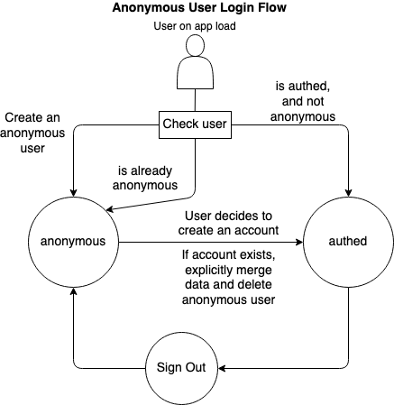

# Anonymous First, Passwordless Second Firebase Authentication - October 11, 2020

In todays world we have SO many ways to provide users with a persistent, attributed, and social experiences.  Many apps implement some form of a user session perhaps with accounts and authentication.  Social logins are a standard and for good reasons.  It's nice to never have to worry about remembering a specific password for a different app and as a developer you don't need to worry about managing a user table and correctly handle passwords.  

HOWEVER, There appears to be a path of least resistance at play.  It seems like every app I download presents me with this google, facebook, or apple "authentication wall" before I'm even allowed to use the application downloaded.  

Why force users to authenticate to an application before they even get a chance to try it out?

Don't get me wrong, there's value in user attribution in applications.  It's cool to know who posted what and when.  If you need to store data related to users actions but you don't directly need the users information to deliver value to your application, why not go anonymous first?

This post will leverage firebase authentication to demonstrate the concept of anonymous first, passwordless authentication.  I will aim to target 2 powerful features firebase provides developers Anonymous Users and Passwordless Authentication. They can be mutually exclusive, but together they work quite nice.

## Anonymous Users

Anonymous users don't expire, and there isn't currently any automated way to purge them.

Treat an anonymous account just like any other authenticated account, it's just not linked with a social provider and you don't have any specific user information like email off the start.  Each anonymous user has their own UID and that can be linked accordingly.

## The Flow

When a user signs out of an authenticated user make the choice to save some data or completely wipe local data when returning them back to an anonymous state.

Add in some example code for how to handle migrations

Handle common error states, maybe show what those error states are

## Your title has passwordless in it, but you've only talked about anonymous users.

I know I know.  I just get jazzed up about anonymous users.

Once a user is ready to take their account to the next level and link an email address and perhaps other personal information we can use the good old social provider strategy.  OR we can use this neat Passwordless Authentication approach!  This way we can link a users email address without them needing a password and without them needing a social provider.

## That's it

We can give our users a delightful persistent experience without requiring them to explicitly authenticate to our application.  If they want to later down the line, that's great and we'll persist all their data as they link authentication providers.  But I'll tell you one thing.  It is nice to open an app, try it out and not be pressured into giving away unnecessary information about myself right off the bat.

## References
- [Anonymous Users on iOS Firebase Documentation](https://firebase.google.com/docs/auth/ios/anonymous-auth)
- [Email Link Firebase Docs](https://firebase.google.com/docs/auth/ios/email-link-auth)
- [Account Linking Docs](https://firebase.google.com/docs/auth/ios/account-linking)
- [Anonymous Users iOS SwiftUI Firebase Video](https://www.youtube.com/watch?v=HDde7TqKCpk&t=2837s)
- [Magic links in iOS Video Tutorial](https://youtu.be/J-jtCB0jzTE)