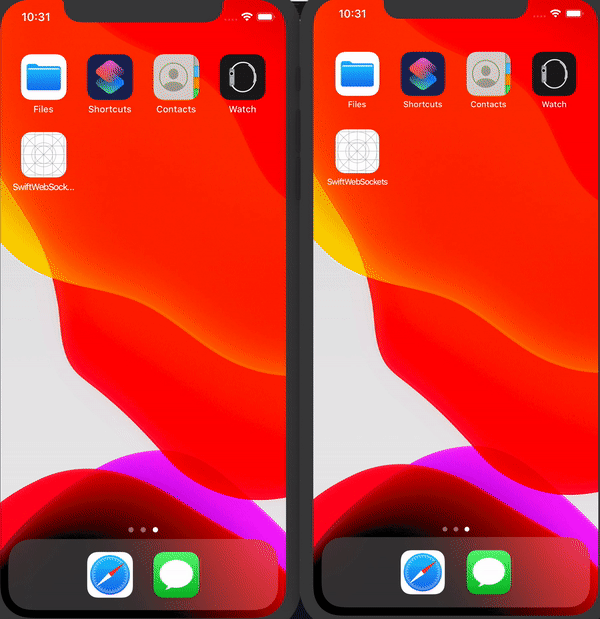

# State of Swift Sockets - October 24, 2019

### Primary Projects
- SwiftWebSockets, A swiftUI chat client with a websocket networking layer
- SwiftWebSocketServer, A native Swift websocket server
- [blog post](./SwiftWebSockets.md) related to the talk

### Supplimental Subprojects
- nodesocket, Node websocket server
- websockets presentation slides
- StarscreamComparison, A comparison project between native and starscream's api implementation

### Instructions
- Open `SwiftWebSocketClientServer.xcworkspace` in XCode
- Run `SwiftWebSocketServer` - _server_
- Run `SwiftWebSockets` - _client_
- Enjoy!

