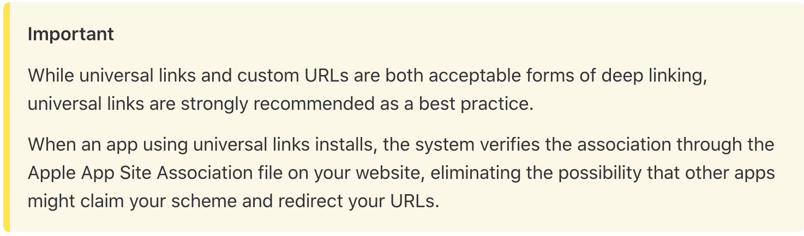
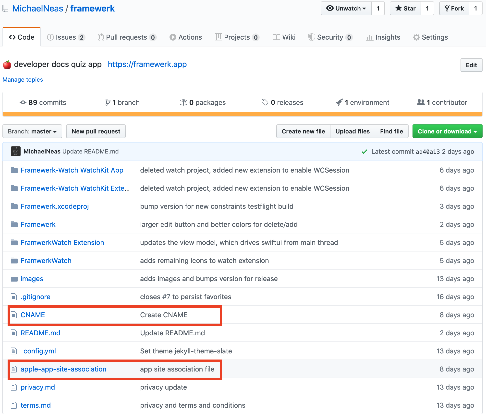
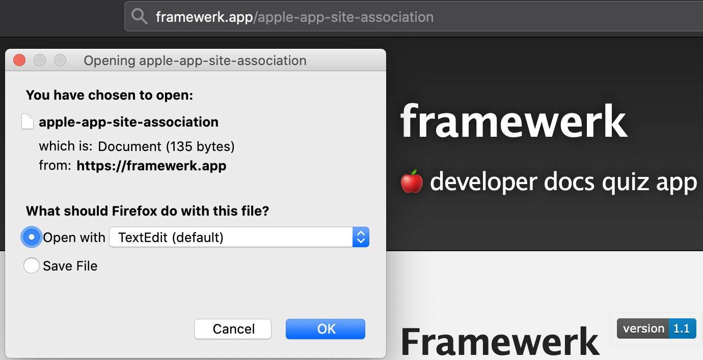
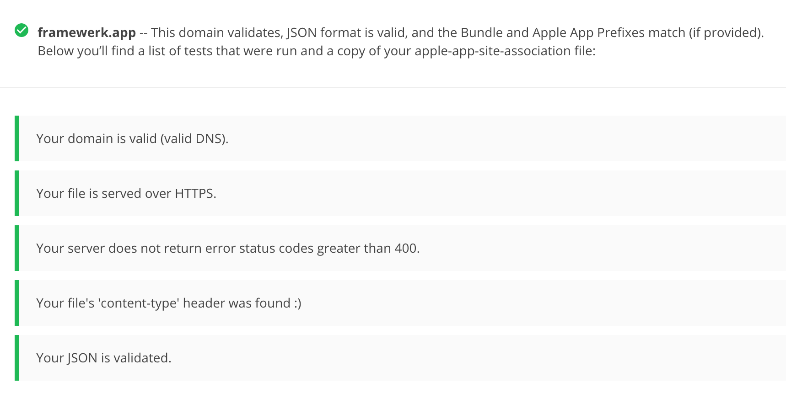
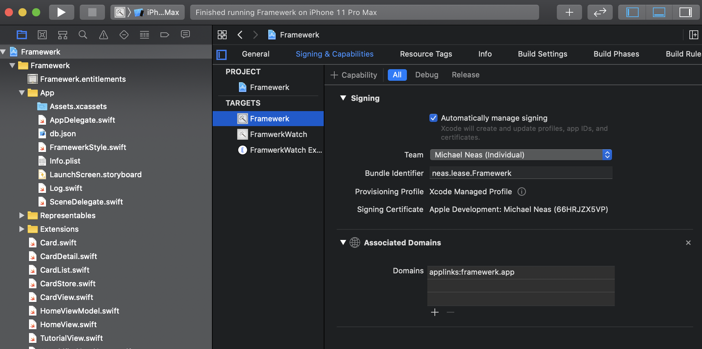
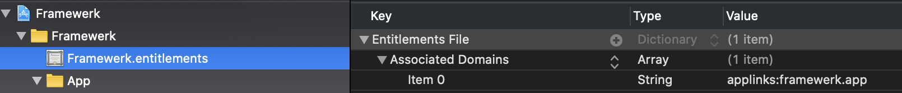
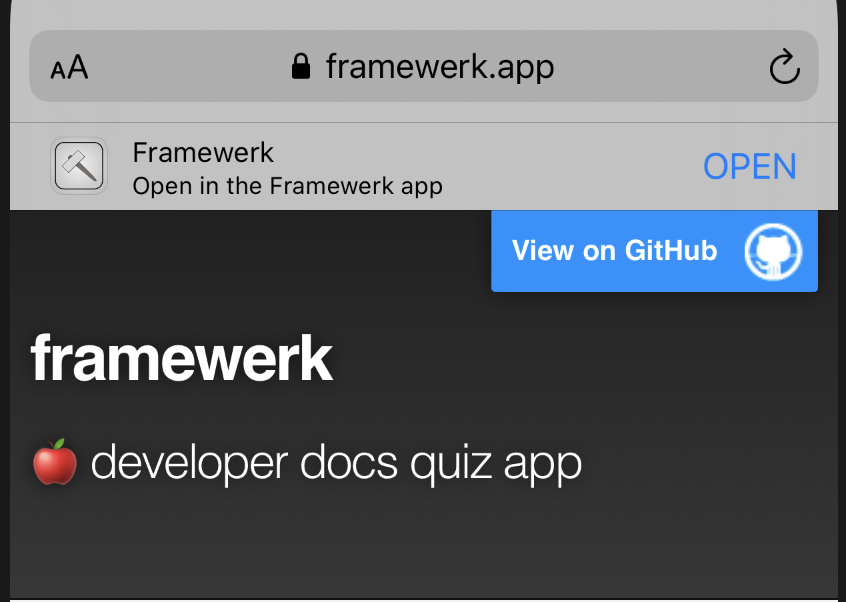

# Associated Domains With Github Pages

1. Want to set up universal links for your various Apple platform applications?
2. Don't have the desire, time, or resources to spin up or maintain a full website and server(s)?

We can leverage Github Pages and Associated Domains to enable universal links.  This method accomplishes our #1 goal with minimal cost.  In a short amount of time we can set up a web based landing page and generate a sharable link to quickly distribute an app to new and existing users.  For new users, universal links should redirect to a specific application on the App Store. If the application is already downloaded, we can provide in-app routing and easily navigate our users to the content they care about most.

We will demonstrate an example project that accomplishes all of this using 1 repository!

If you're interested in why Apple officially recommends Universal Links for deep linking check [this out](https://developer.apple.com/documentation/uikit/inter-process_communication/allowing_apps_and_websites_to_link_to_your_content)

TL;DR:


During [WWDC 2019](https://developer.apple.com/videos/play/wwdc2019/717/), a handful of fundamental changes were presented with [Associated Domains](https://developer.apple.com/documentation/safariservices/supporting_associated_domains_in_your_app)

**As of the iOS13 release there has been some inconsistent behavior [noted](https://forums.developer.apple.com/thread/123554).  I can still get universal links working consistently running directly on device, but the redirect to the App Store and fresh App Store downloads on iOS 13+ have not been reliable.  I will update this post with any new Associated Domain release notes.  If this issue is due to not serving the association file as `application/json` we will unfortunately not be able to continue with Github Pages, as they do not allow custom redirects or MIME types.**

## Universal Links Basics

Universal links require three things:
1. An apple-app-site-association file served from a website
2. A valid association file with all routing information desired using [wildcards and directives](https://developer.apple.com/documentation/uikit/inter-process_communication/allowing_apps_and_websites_to_link_to_your_content/enabling_universal_links#3002228) as needed.
3. The Associated Domains entitlement and capability inside the project itself.

The basic universal link setup for iOS/tvOS 12 and below looks like this:
```
{
    "applinks": {
        "apps": [],
        "details": [
            {
                "appID": "<TEAM_DEVELOPER_ID>.<BUNDLE_IDENTIFIER>",
                "paths": [ "*" ]
            }
        ]
    }
}
```

In iOS/tvOS 13 and macOS 10.15 we have a modified structure.
```
{
    "applinks": {
        "details": [
            {
                "appIDs": [ "<Application Identifier Prefix>.<Bundle Identifier>" ]
                "components": [{
                    "/": "/path/*",
                    "#": "*fragment",
                    "?": { "param": "?*", "key": "value" },
                    "exclude": true
                }]
            }
        ]
    }
}
```

#### What are any of these keys? 
- `applinks`: Defines the service type for universal links
- `apps`: Not used for universal links, but it must be present and set to an empty array for iOS 12/tvOS 12 and below
- `details`: A list of applications handling the links for a given website, along with the specific sections of the website being handled.
- `appID`: identifier of the application handling the paths
- `paths`: sections of the website supported by the linked application.  These paths are specified as an array of qualifying strings, where `*` covers all permutations of a path.  This list gives us control over when we want universal linkage.
- `appIDs`: an array of app identifiers
- `components`: Apple's new way to match specific path identifiers, including fragment and query components. If this key exists, the `paths` key will be ignored across all new platform releases.  If we don't specify a component, it will be ignored by default. Also, `exclude` takes the place of the previous `NOT` keyword. There are good examples at [this point in the WWDC talk](https://developer.apple.com/videos/play/wwdc2019/717/?time=437).

**Note:**
```
The prefix may or may not be equal to your team identifier
```

Apple goes into more expressive examples in [their documentation](https://developer.apple.com/documentation/uikit/inter-process_communication/allowing_apps_and_websites_to_link_to_your_content/enabling_universal_links)

##### The important caveat to remember

```
iOS 12 uses the paths array and is not aware of the appIDs key. 
If you have multiple applications, use the singular appID key and 
specify a separate details dictionary for each application.
```

## Website Setup

When I started looking at using Github's static site service for universal linking my project was already using Github.  This allowed me to adjust the settings of the repository and enable Github Pages.  If you don't know what Github Pages is, [definitely check it out](https://pages.github.com/)!  Once you turn on Pages we can get to the good stuff.

As of WWDC 2019 Apple requires the app site association file **always** be located under the `/.well-known/` path.  Previously (iOS 12 and below) Apple supported the existence of this file at the root, but this is now officially deprecated.  To support the well-known directory we need to add `include: [".well-known"]` to our `_config.yml` file that Pages generates.

Github Pages provides a domain out of the box, but namespaces a path from our repository name, (ie. `michaelneas.github.io/somecoolproject`).  Therefore we don't have control over the root path and to satisfy the "fully qualified domain" requirement we'll need to create a custom domain name and assign it to our Pages repo.

I highly recommend using [domains.google.com](domains.google.com/), a domain can cost $12/year.  There are 3 steps for linking Google Domains with Github Pages, instructions are found [here](https://dev.to/brunodrugowick/github-pages-and-google-domains-together-5ded).  

At this point we can asynchronously wait for the existence of our site to propagate across the web and allow HTTPS certificates to be approved, distributed, and registered for our site.  Github will automatically generate a CNAME after the domain is entered in the project settings. 

The last step is to drop our app-site-association file in the `/.well-known` directory of our repository.  Do not add a filetype to the file and Github Pages will serve the "content-type" as "application/octet-stream".



## Validation

If we navigate to our new website and add the path `/.well-known/apple-app-site-association` after the domain something like this should appear:


There are many sites that validate association files, but commonly suggested validators include [Apple](https://search.developer.apple.com/appsearch-validation-tool) or [Branch.io](https://branch.io/resources/aasa-validator/).  **Some validators may not correctly respond to the new format from the WWDC 2019 additions to association files**

Validators typically check for these 5 things:


Once that's all set, we're ready to connect the iOS app.

## Application

At a minimum, an application requires the addition of the `applinks` service type property inside the Associated Domains capability in order to link the website we just created.  Enable the associated domains capability and insert `applinks:url` under `Domains` as seen in the image below.  These applinks also support subdomains, which will take priority.  The entitlements file will be updated automatically.



The next time the app is installed the device will reach out to the associated site and confirm the association.  If the app is now ran, navigate to Safari, type in the url we set up before, and scroll a little, we will see the Smart App Banner! 

_The "open in app" banner is offset by default, which is why the brief scroll is required to see it.  If interested, a few lines of javascript can be used to auto scroll users when they land on a page_



In the app itself we can see incoming requests in the `userActivity` method in the `AppDelegate`. From there we can parse the arguments and bubble up whatever views/content we want based on where the user is coming from.

More specific handling details for different platforms can be found [here](https://developer.apple.com/documentation/uikit/inter-process_communication/allowing_apps_and_websites_to_link_to_your_content/handling_universal_links) or [here if you prefer video](https://developer.apple.com/videos/play/wwdc2019/717/?time=766).

## Final Words


If you want to see this all working for yourself I vetted this process with an application called [Framewerk](https://apps.apple.com/us/app/framewerk/id1496896308).  If you navigate to [Framewerk.app](framewerk.app), you can see the association file used there.  For iOS 12 and below the setup works flawlessly, but 13 introduces quirkiness.

It is up to us to decide how in depth we want to go with universal linking.  With AppStoreConnect containing fields for marketing and support URL's, why not take the time to add in universal links for users to get to your app easily? This specific setup can be take than 5 minutes plus some additional deployment/certificate processing time to enable universal links.

The example gets our feet wet with universal links.  Universal links are a powerful way to enable users on multiple platforms to explore content.  At this point we also have the option to enable [webcredentials](https://developer.apple.com/documentation/security/shared_web_credentials) to pass secure credentials between our associated domains.

If you're interested in diving in to web development and plan to support more than what Markdown/basic html gives us you can set up a [react based github pages site](https://github.com/gitname/react-gh-pages).  This can provide an expressive router within a static site and perhaps enable more of a dynamic feel to the site.  The process in the steps above will be exactly the same regardless of how you want to make your website.  Another very popular solution is to use [firebase](https://firebase.google.com/docs/dynamic-links/ios)

If you'd like a fun exercise, go to one of your favorite sites and check out their association file.  Remember they will only exist in two places, and as of iOS 13+, they will always be in `/.well-known/`.  AASA files can be absolutely massive. (Here is [Youtube's](https://www.youtube.com/apple-app-site-association))

## Helpful Links
- [AASA Gist](https://gist.github.com/anhar/6d50c023f442fb2437e1)
- [Apples Universal Link Validator](https://search.developer.apple.com/appsearch-validation-tool)
- [Branch.io validator](https://branch.io/resources/aasa-validator/)
- [Apple Docs for Universal Links](https://developer.apple.com/documentation/uikit/inter-process_communication/allowing_apps_and_websites_to_link_to_your_content/enabling_universal_links)
- [Associated Domains, by Apple](https://developer.apple.com/documentation/safariservices/supporting_associated_domains_in_your_app)
- [Google Domains and Github Pages](https://dev.to/trentyang/how-to-setup-google-domain-for-github-pages-1p58)
- [Custom Domains with Github Pages](https://help.github.com/en/github/working-with-github-pages/configuring-a-custom-domain-for-your-github-pages-site)
- [Universal links checklist](https://gist.github.com/andrewrohn/774185e4e15ddcc14f0a1e3c66c943e3)
- [React Github Pages](https://github.com/gitname/react-gh-pages)
- [Universal vs deep links](https://www.adjust.com/blog/universal-links-vs-deep-links/)
- [WWDC 2019 updates](https://developer.apple.com/videos/play/wwdc2019/717/)
- [iOS 13 universal link breakage thread](https://forums.developer.apple.com/thread/123554)
