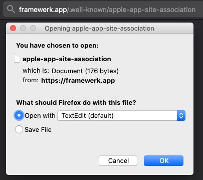

# Associated Domains with Github Pages

1. Want to set up universal/deep links for your iOS applications?
2. Don't have the desire, time, or resources to spin up or maintain a full website and server(s)?

With Github pages or other static web service providers, we can still enable universal links for our iOS applications.  This method accomplishes our goal with minimal cost.  In a matter of minutes we can set up a web based landing page or sharable link to quickly distribute your app to new or existing users.  For new users, universal link configurations redirect to your application on the app store. If the app is already downloaded we can provide incredibly advanced in-app routing and easily navigate our users to parts of the app that they care the most about.

This example accomplishes all of this using 1 repository!

## Universal Links Basics

Enabling universal links requires three main steps:
1. Add an app-site-association file to a website
2. Add the associated domains entitlement to the iOS app.
3. Fill out the association file with all the routing you desire using [wildcards and directives](https://developer.apple.com/documentation/uikit/inter-process_communication/allowing_apps_and_websites_to_link_to_your_content/enabling_universal_links#3002228)

You can grab an example apple-app-site-association file [here](./apple-app-site-association).  

The basic example to set up universal links looks like this:
```
{
    "applinks": {
        "apps": [],
        "details": [
            {
                "appID": "<TEAM_DEVELOPER_ID>.<BUNDLE_IDENTIFIER>",
                "paths": [ "*" ]
            }
        ]
    }
}
```
- `applinks`: The key Apple looks for universal linking
- `apps`: Not used for universal links, but it must be present and set to an empty array for < iOS12
- `details`: A list of apps handling universal links for your website, along with the specific sections of your website each app handles.
- `appID`: identifier of the application that will handle the paths, in our case an iOS app
- `paths`: sections of your website supported by the app specified as an array of path strings, `*` will catch all paths.  The paths list give us control over when we want the "open app" banner to appear on our website. 

Apple goes into more examples [here](https://developer.apple.com/documentation/uikit/inter-process_communication/allowing_apps_and_websites_to_link_to_your_content/enabling_universal_links)

One caveat here is:
```
iOS 12 uses the paths array and is not aware of the appIDs key. If you have multiple applications, use the singular appID key and specify a separate details dictionary for each application.
```

## Website Setup

My project was already using Github, this allows me to go to the settings of the repository and enable Github Pages.  If you don't know what github pages is, [definitely check it out](https://pages.github.com/)!  Once you flip on the pages switch we can get in to the good stuff.

Today (May 1, 2020) Apple requires your app site association file to be either at the root or in the `/well-known/` directory of your website.  Github pages gives us a domain out of the box, but namespaces our repos with an additional path, (ie. michaelneas.github.io/coolproject). So we'll need to create a custom domain name and assign it to our github pages repo to satisfy the fully qualified domain requirement.  

I highly recommend using [domains.google.com](domains.google.com/), where you can purchase a $12/year domain of your liking.  There are 3 steps for linking google domains with github pages, instructions are found [here](https://dev.to/brunodrugowick/github-pages-and-google-domains-together-5ded).  At this point we have to wait for the existence of our site to propagate across the web and HTTPS certificates to be approved and registered for our static site.  Github will automatically generate a CNAME for you after you enter in your fancy new domain in settings. The last step to do here is drop your app-site-association file in the root directory of your project.  Do not add a filetype to the file and github pages will serve the "content-type" automatically for you.


## Validation

We should be all hooked up now to begin the validation step of our universally linked website.  

If you navigate to your new website type in `/apple-app-site-association` after the domain and make sure something like this happens:


There's a ton of sites that do this, but I suggest using [Apple's](https://search.developer.apple.com/appsearch-validation-tool) or [Branch.io's](https://branch.io/resources/aasa-validator/) validator.  Once that's all set to go we're ready to connect up the iOS app.

Validators typically check for these 5 things:


## iOS App

At a minimum an iOS app requires the addition of the `applinks` property to a project in order to link the website we just created.  Start by enable the associated domains capability.  Following that, insert `applinks:url` under `Domains` as seen in the image below.  The entitlements file will be updated automatically for you.


Without doing anything else, if we run the app in simulator, navigate over to safari, type in the url we set up before, and scroll down (the apple "open" button will be offset from the out of the box setup, we can add a few lines of javascript to always show the open drawer).


On the iOS app itself we can see incoming requests in the `userActivity` method in the AppDelegate. From there we can parse the arguments and bubble up whatever view we want based on where the user was coming from.

More specific handling details for specific platforms can be found [here](https://developer.apple.com/documentation/uikit/inter-process_communication/allowing_apps_and_websites_to_link_to_your_content/handling_universal_links)

## Final Words


If you want to see this all working for yourself I have an application called [Framewerk](https://apps.apple.com/us/app/framewerk/id1496896308).  If you navigate to [Framewerk.app](framewerk.app), you'll see the static site will point you to download the iOS app on the app store.

It is up to the developer to decide how in depth they want to go with universal linking.  With AppStoreConnect containing fields for marketing and support URL's, why not take the time to add in universal links for users to get to your app? The setup can be less than 5 minutes plus some deployment/certificate time to enable universal links.  

This is a quick setup to get our feet in the door with universal links.  We can link to anywhere in our app based on where the user is on the website.  Universal links are a powerful way to allow users multiple platforms to explore your content.  At this point we also have the option to enable [webcredentials](https://developer.apple.com/documentation/security/shared_web_credentials) to pass secure credentials between our associated domains.

Further more if you're interested in diving in to a website and plan to support more than what Markdown/basic html gives us you can set up a [react based github pages site](https://github.com/gitname/react-gh-pages).  This can give you an expressive router within a static site and perhaps enable a bit more of a dynamic feel to your site.

## Resources
- [AASA Gist](https://gist.github.com/anhar/6d50c023f442fb2437e1)
- [Apples Universal Link Validator](https://search.developer.apple.com/appsearch-validation-tool)
- [Branch.io validator](https://branch.io/resources/aasa-validator/)
- [Apple Docs for Universal Links](https://developer.apple.com/documentation/uikit/inter-process_communication/allowing_apps_and_websites_to_link_to_your_content/enabling_universal_links)
- [Google Domains and Github Pages](https://dev.to/trentyang/how-to-setup-google-domain-for-github-pages-1p58)
- [Custom Domains with Github Pages](https://help.github.com/en/github/working-with-github-pages/configuring-a-custom-domain-for-your-github-pages-site)
- [Universal links checklist](https://gist.github.com/andrewrohn/774185e4e15ddcc14f0a1e3c66c943e3)
- [React Github Pages](https://github.com/gitname/react-gh-pages)